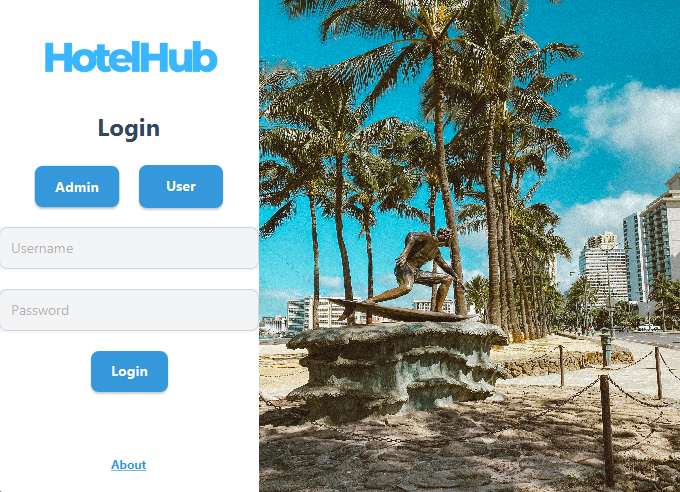

This project is a basic Hotel Management System, developed as a university project to showcase fundamental skills in JavaFX and general programming.

Features:
Login System with two roles:
Admin (Username: admin, Password: admin)
User (Username: user, Password: user)
Each role has its own set of functionalities.
Persistent Data Storage – All changes made within the application are saved within the project, ensuring data consistency.
Screenshots
Below are some screenshots showcasing the application's interface and functionalities.

Login Page

Admin Dashboard

Staff Manager

Room Manager

Monthly Expenses

User Dashboard

My Bookings

Book rooms
